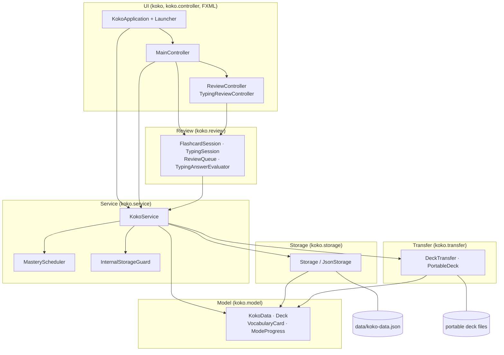
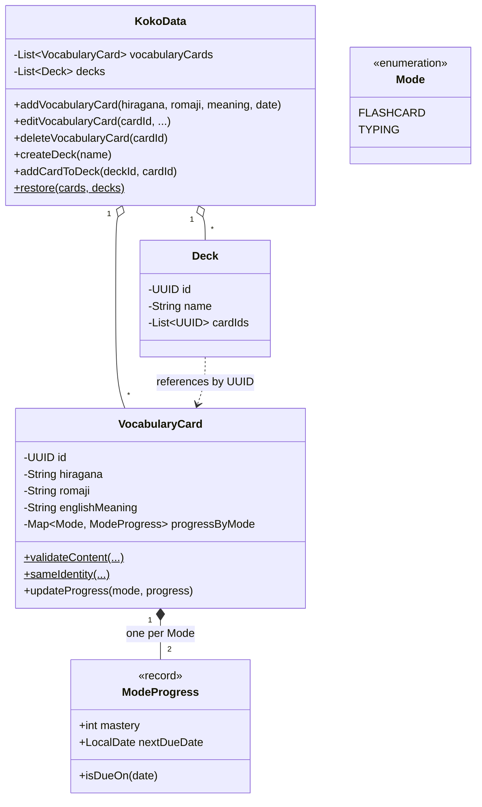
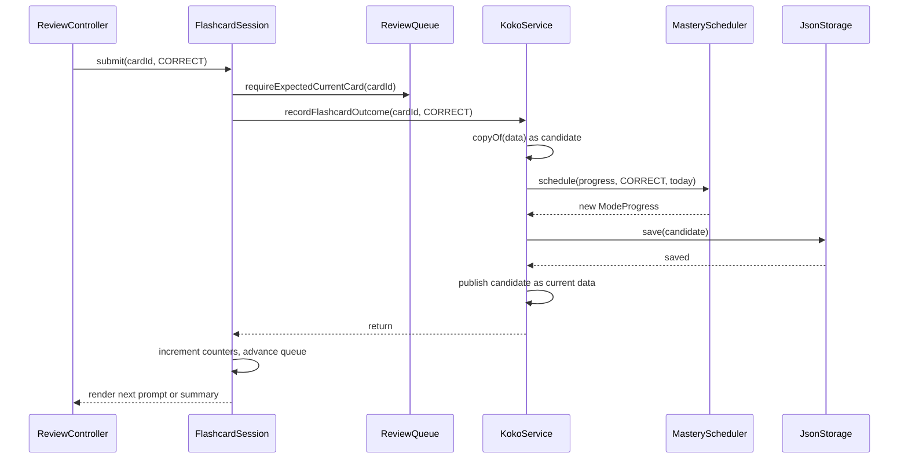
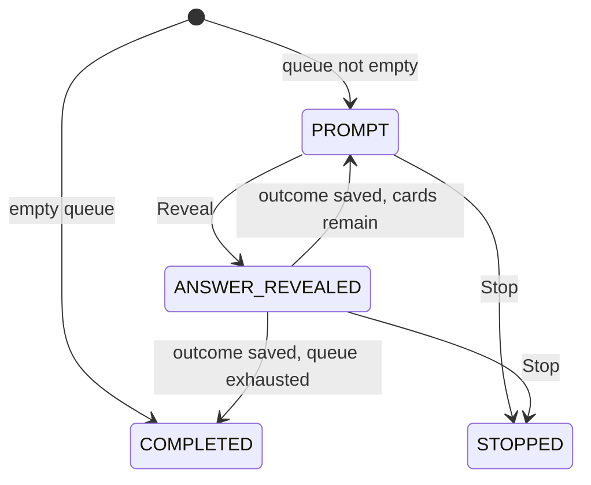
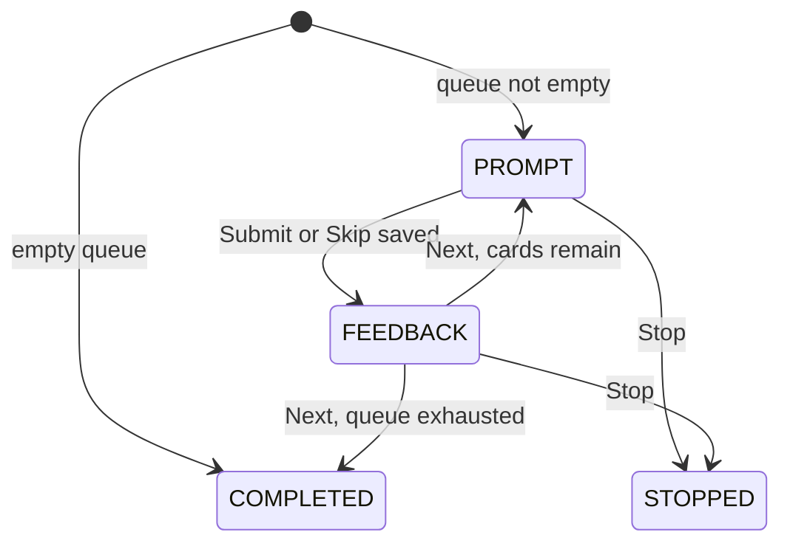

# Koko Developer Guide

Koko is a button-driven JavaFX desktop application for learning Japanese vocabulary. It keeps one global vocabulary library whose cards can belong to several study decks, and users can practice in two independent modes: Flashcard and Typing.

This guide describes the design of the app and the engineering practices used to build it. For end-user instructions, see the [User Guide](UserGuide.md).

## Contents

- [Acknowledgements](#acknowledgements)
- [Setting up, getting started](#setting-up-getting-started)
- [Design](#design)
- [Implementation](#implementation)
- [Documentation, testing, dev-ops](#documentation-testing-dev-ops)
- [Appendix: Requirements](#appendix-requirements)
- [Appendix: Instructions for manual testing](#appendix-instructions-for-manual-testing)

---

## Acknowledgements

- Libraries used: [JavaFX](https://openjfx.io/) for the GUI, [Jackson Databind](https://github.com/FasterXML/jackson-databind) for JSON, [JUnit 5](https://junit.org/junit5/) for tests, and [Gradle](https://gradle.org/) with the [Shadow](https://gradleup.com/shadow/) and [OpenJFX](https://github.com/openjfx/javafx-gradle-plugin) plugins for the build.
- The Checkstyle configuration in [`config/checkstyle`](../config/checkstyle) enforces the [se-education.org Java coding standard](https://se-education.org/guides/conventions/java/intermediate.html).
- The structure of this guide (Design / Implementation / Requirements / manual-testing appendices) is adapted from the [AddressBook-Level3](https://github.com/se-edu/addressbook-level3) Developer Guide by the [SE-EDU initiative](https://se-education.org). No AB3 source code is reused; Koko is a greenfield project.
- Koko was built with AI assistance as required by the module. The conventions the assistant had to follow are recorded in [AGENTS.md](../AGENTS.md).

---

## Setting up, getting started

**Prerequisites:** JDK 25 (a JavaFX-enabled distribution such as Zulu `jdk+fx` is convenient but not required, since the build pulls JavaFX from Maven Central), Git, and a desktop environment for running the GUI.

Verify that both `java -version` and `javac -version` report 25. On macOS with SDKMAN, select the project JDK in the working terminal:

```bash
sdk use java 25.0.3.fx-zulu
```

Clone the repository, then run all commands from the repository root (the folder containing `build.gradle`). On Windows PowerShell, replace `./gradlew` with `.\gradlew.bat`.

| Command | Purpose |
| --- | --- |
| `./gradlew run` | Launch the app for development. |
| `./gradlew test` | Run the JUnit tests. |
| `./gradlew test --tests koko.service.KokoServiceTest` | Run one test class. |
| `./gradlew check` | Run tests and Checkstyle over main and test sources. |
| `./gradlew shadowJar` | Package the app for **this** platform into `build/libs/koko.jar`. |
| `./gradlew releaseJar` | Package the cross-platform distribution into `release/koko.jar`. |
| `java -jar build/libs/koko.jar` | Launch the packaged app. |
| `./gradlew clean check shadowJar releaseJar` | Full clean verification and rebuild of both JARs. |

Test and Checkstyle reports are written to `build/reports/`. `clean` deletes build output only; it does not touch the runtime library in `data/` or the committed `release/` JAR.

**Build configuration:** Java 25 toolchain, JavaFX 25 (`javafx.controls`, `javafx.fxml`), Gradle wrapper 9.7.1, Jackson Databind 2.19.2, JUnit Jupiter 5.14.1, Checkstyle 11.0.0, UTF-8 sources, entry point `koko.Launcher`.

### The two JARs

`shadowJar` uses the OpenJFX Gradle plugin's dependencies, which resolve to **this machine's** JavaFX build — the right thing for development and for `./gradlew run`.

`releaseJar` is a second `ShadowJar` task that builds `release/koko.jar` from its own configurations instead, so the distributed file carries JavaFX for several platforms and runs on a plain JDK 25 with no JavaFX of its own. Two details are worth knowing before editing it:

- **One architecture per platform.** JavaFX ships identically named natives (`libglass.dylib`, `libglass.so`) for the x64 and ARM builds of macOS and Linux, so a flat JAR can hold only one of each. The release set is `win`, `mac-aarch64`, and `linux`; changing it is a one-line edit to `releasePlatforms` in [`build.gradle`](../build.gradle).
- **One configuration per platform.** The platform variants of a JavaFX module declare the same Gradle capability and cannot resolve in a single configuration, so each platform gets its own, with `@jar` to keep the dependencies artifact-only.

**Continuous integration:** [Java CI](../.github/workflows/gradle.yml) runs `./gradlew check shadowJar releaseJar` on every push and pull request across Ubuntu, macOS, and Windows using Zulu JDK 25. It does not run GUI tests or publish artifacts, so a green build says nothing about rendering, focus behavior, or native dialogs.

---

## Design

### Architecture



**Main:** [`Launcher`](../src/main/java/koko/Launcher.java) starts [`KokoApplication`](../src/main/java/koko/KokoApplication.java), which creates the system-default-zone `Clock`, a `JsonStorage`, and a single `KokoService`; loads the library; and supplies those collaborators to controllers through a small FXML controller factory.

The rest of the app is split into these components:

| Component | Responsibility |
| --- | --- |
| **UI** (`koko.controller` + FXML) | Renders state, collects input, shows dialogs. Holds no domain rules. |
| **Review** (`koko.review`) | JavaFX-independent session lifecycle: queue selection, action guards, answer evaluation, counters. |
| **Service** (`koko.service`) | Owns the current library, the persistence boundary, and the scheduling policy. |
| **Model** (`koko.model`) | Domain objects and their invariants. Depends on nothing else in the app. |
| **Storage** (`koko.storage`) | Reads and writes the whole library as JSON. |
| **Transfer** (`koko.transfer`) | Reads and writes the separate portable single-deck format. |

Two seams keep the design testable without a framework: `Storage` and `ReviewScheduler` are interfaces the service depends on, and every date comes from an injected `java.time.Clock`. As a result, everything except the controllers can be tested headlessly.

**Where to make a change**

| Concern | Starting point |
| --- | --- |
| Card or deck invariants | [`koko.model`](../src/main/java/koko/model) |
| A persistent library operation | [`KokoService`](../src/main/java/koko/service/KokoService.java) |
| Session lifecycle, ordering, answer checking | [`koko.review`](../src/main/java/koko/review) |
| Mastery and due-date policy | [`MasteryScheduler`](../src/main/java/koko/service/MasteryScheduler.java) |
| Library file format | [`JsonStorage`](../src/main/java/koko/storage/JsonStorage.java) |
| Portable deck format and export safety | [`DeckTransfer`](../src/main/java/koko/transfer/DeckTransfer.java), [`InternalStorageGuard`](../src/main/java/koko/service/InternalStorageGuard.java), [`TransferFileNames`](../src/main/java/koko/controller/TransferFileNames.java) |

### UI component

| View | Controller | Role |
| --- | --- | --- |
| [`MainWindow.fxml`](../src/main/resources/koko/view/MainWindow.fxml) | [`MainController`](../src/main/java/koko/controller/MainController.java) | Home screen: vocabulary and deck management, mode selection, transfer, entering and leaving review. |
| [`ReviewView.fxml`](../src/main/resources/koko/view/ReviewView.fxml) | [`ReviewController`](../src/main/java/koko/controller/ReviewController.java) | Flashcard prompt, revealed answer, summary. |
| [`TypingReviewView.fxml`](../src/main/resources/koko/view/TypingReviewView.fxml) | [`TypingReviewController`](../src/main/java/koko/controller/TypingReviewController.java) | Typing prompt, answer field, feedback, summary. |
| [`HelpView.fxml`](../src/main/resources/koko/view/HelpView.fxml) | — | Static help content loaded into a dialog. |

The [User Guide's screen tour](UserGuide.md#koko-at-a-glance) shows what the Home screen looks like and names each area.

The UI component:

- keeps one `Scene` and swaps its root between the Home root and a review root; returning Home re-renders lists, restores selections by UUID, and reports the session summary.
- disables management, review, and transfer controls while a review is active, and also when the library failed to load at startup. Help stays available in both cases.
- guards every review action with the UUID of the card currently displayed plus an `actionInProgress` flag, so a queued or repeated event cannot act on a different card.
- defers the Typing focus request with `Platform.runLater`, re-checking that the same prompt is still current, the field is attached to a scene, and input is enabled.
- performs no validation of its own: it passes user input to the service and renders the resulting error.

### Service component

**API:** [`KokoService`](../src/main/java/koko/service/KokoService.java)

The service is the only component allowed to change durable state. It holds the current `KokoData`, the `Storage`, the `Clock`, a `ReviewScheduler`, and a `DeckTransfer`. Every mutating operation follows the same save-before-publish sequence described under [Implementation](#save-before-publish).

`data()` returns the current aggregate for **read-only** use. Domain objects obtained from it may be replaced by the next successful operation, so callers keep UUIDs and re-fetch objects rather than holding references across a mutation.

### Model component



The model component:

- stores the **global** vocabulary library. A `Deck` owns only an ordered list of card UUIDs, never card copies and never progress. A card may belong to zero or more decks, at most once per deck, and every stored reference must resolve to an existing card.
- keeps card identity stable across edits: editing text preserves the UUID, deck memberships, and both progress records.
- treats two cards as the same vocabulary when their normalized Hiragana matches and their English meanings match case-insensitively. Romaji is deliberately excluded from identity. Deck names are unique ignoring case.
- normalizes card text to Unicode NFC and strips surrounding whitespace. Hiragana fields accept Hiragana, inline spaces, and the prolonged sound mark `ー`; Romaji and English accept Latin letters, digits, spaces, and common punctuation. Control characters and line or paragraph separators are rejected. Deck names use a looser rule: non-blank after stripping, with no unpaired surrogates.
- validates the complete proposed edit before any field changes, so a rejected edit leaves the card untouched.
- exposes collections as unmodifiable views, but the objects themselves are **not** immutable — `ModeProgress` is the only immutable value. All application changes must go through the service.

### Storage component

**API:** [`Storage`](../src/main/java/koko/storage/Storage.java) — implemented by [`JsonStorage`](../src/main/java/koko/storage/JsonStorage.java)

The storage component:

- saves and loads the entire library as one JSON document at `data/koko-data.json`, resolved against the process working directory. Tests supply their own path.
- treats a missing file as an empty library and does not create one; the file appears on the first successful save.
- parses strictly: duplicate JSON keys, trailing content, unknown or missing fields, wrong JSON types, coerced scalars ("1" for `1`), unsupported schema versions, invalid UUIDs or dates, duplicate identities, and dangling deck references are all rejected. An invalid file is reported and left untouched.
- replaces the file by writing a uniquely named sibling temporary file with `CREATE_NEW` and then moving it with `ATOMIC_MOVE` + `REPLACE_EXISTING`. There is no non-atomic fallback: if the filesystem cannot move atomically, the save fails and the previous file survives.
- exposes `configuredPath()` so the service can refuse to export over the library file.

The contract is that a failed save leaves the previously persisted state intact (including "absent" when nothing was saved yet). It is not a locking protocol: it does not coordinate multiple Koko instances and does not promise power-loss durability.

<details>
<summary>Internal library JSON (schema version 1)</summary>

```json
{
  "schemaVersion": 1,
  "cards": [
    {
      "id": "11111111-1111-1111-1111-111111111111",
      "hiragana": "ねこ",
      "romaji": "neko",
      "englishMeaning": "cat",
      "progress": {
        "FLASHCARD": { "mastery": 1, "nextDueDate": "2026-09-01" },
        "TYPING": { "mastery": 0, "nextDueDate": "2026-08-31" }
      }
    }
  ],
  "decks": [
    {
      "id": "22222222-2222-2222-2222-222222222222",
      "name": "Animals",
      "cardIds": ["11111111-1111-1111-1111-111111111111"]
    }
  ]
}
```

Both mode keys are required, `mastery` must be an integer from 0 to 5, and `nextDueDate` must parse as a `LocalDate`. Because unknown fields are rejected, any future field is a breaking change: bump `schemaVersion`, decide the compatibility behavior explicitly, and add fixtures for both accepted and rejected documents before changing the reader.

</details>

### Transfer component

**API:** [`DeckTransfer`](../src/main/java/koko/transfer/DeckTransfer.java)

The portable format is intentionally separate from the storage format. It carries one deck's text only, so a deck can be shared without exporting anyone's learning progress or internal IDs.

| | Internal library | Portable deck |
| --- | --- | --- |
| Written by | `JsonStorage` | `DeckTransfer` |
| Root fields | `schemaVersion`, `cards`, `decks` | `schemaVersion`, `deckName`, `cards` |
| Scope | Whole library and all memberships | One ordered deck |
| Identity | Card and deck UUIDs | None; identity is resolved from card text on import |
| Progress | Mastery and due dates for both modes | Not present |

`DeckTransfer` requires *exactly* the allowed field sets — extra fields such as `id` or `progress` are rejected, as are missing ones — reads files as strict UTF-8, and rejects duplicate vocabulary inside one document. See [`examples/koko-sample-deck.json`](../examples/koko-sample-deck.json) for a complete 12-card fixture.

---

## Implementation

This section covers the parts of Koko whose behavior is not obvious from the class names.

### Save before publish

Every durable change — adding a card, editing a deck, importing, recording a review outcome — uses the same four steps in `KokoService`:

1. Make a detached deep copy of the current `KokoData`, preserving UUIDs and the immutable progress values.
2. Validate and apply the change to that **candidate**. An invalid change throws here and never reaches the disk.
3. Call `storage.save(candidate)` exactly once.
4. Only after the save succeeds, publish the candidate as the current state and return to the caller.

The sequence below shows the path for a flashcard outcome, which additionally consults the scheduler:



If `save` throws a `StorageException`, the candidate is discarded, the previously published state and its objects are untouched, the session's counters and queue position do not move, and the controller reports the failure while keeping the entered answer or revealed card available. Retrying after fixing the cause applies the action exactly once. This is why counters must never be updated before the service call returns.

| Failure | Behavior |
| --- | --- |
| Library invalid or unreadable at startup | The error is reported, the file is left untouched, and management, review, and transfer are disabled. Help still opens. |
| Invalid form input | The controller shows the domain's message and keeps the entered values for correction. |
| Save failure during management or review | Nothing is published; the action can be retried. |
| Import read or validation failure | No candidate is built; the file must be fixed and chosen again. |
| Import save failure | The name dialog keeps the prepared document and the typed name for a retry. |
| Export failure | Internal state is unchanged; the user chooses a destination again. |

`StorageException` and `DeckTransferException` are checked exceptions used at the two I/O boundaries. Domain rule violations use `IllegalArgumentException`, and invalid session operations use `IllegalStateException`.

### Review sessions

Both session classes are JavaFX-independent and share [`ReviewQueue`](../src/main/java/koko/review/ReviewQueue.java), which is **frozen**: it captures an immutable list of card UUIDs when the session starts and never grows or reorders, even if the session runs past midnight.

| Selection | Queue contents |
| --- | --- |
| Due cards in a deck | Cards due on or before the start date for the selected mode, oldest due date first; ties keep deck order. |
| All cards in a deck | Every member once, in membership order, regardless of due date. |
| Selected global card | Exactly that card, regardless of due date or membership. |

The queue stores IDs only and resolves card text from the service each time it is used, so publishing a new aggregate can never leave a session holding a stale card object. A stale expected UUID or a card that no longer exists is rejected rather than silently skipped.

**Flashcard session**



Reveal only exposes the answer; nothing is saved. Correct and Incorrect are accepted only in `ANSWER_REVEALED`, and the session advances immediately after the save succeeds. Flashcard has no Skip.

**Typing session**



[`TypingAnswerEvaluator`](../src/main/java/koko/review/TypingAnswerEvaluator.java) strips surrounding whitespace, normalizes to NFC, and compares the answer exactly against the stored Hiragana. It does not transliterate romaji, accept synonyms, or ignore internal spaces; a blank answer is incorrect. Skip records a skipped outcome with an empty entered answer even if the field contained text. **Next** (not Submit) advances, and Next itself saves nothing.

In both modes Stop ends the session without saving the current unanswered card; stopping during Typing feedback keeps the outcome that was already saved, so a stopped session can legitimately show zero remaining. Summaries are derived from counters (`remaining = initial queue size − saved outcomes`) and are never persisted, so sessions do not resume after a restart. See the [User Guide's summary definitions](UserGuide.md#stop-and-read-the-summary).

### Mastery and scheduling

[`MasteryScheduler`](../src/main/java/koko/service/MasteryScheduler.java) is a pure function behind the `ReviewScheduler` interface: given prior progress, an outcome, and a date, it returns a new `ModeProgress`. It never touches cards or storage.

| Outcome | Mastery | Next due date |
| --- | --- | --- |
| Correct | +1, capped at 5 | 1, 3, 7, 14, or 30 days for resulting mastery 1–5 |
| Incorrect | −1, floored at 0 | Tomorrow |
| Skipped (Typing only) | Unchanged | Tomorrow |

The date always comes from the injected clock at submission time, not from the queue's start date or the old due date. Practicing early still updates progress, and elapsed time alone never reduces mastery. `KokoService.recordOutcome` applies the result to the reviewed mode only, so the two modes drift apart independently; it rejects Skip for Flashcard. The same table appears in the [User Guide](UserGuide.md#mastery-and-next-review-date).

### Deck import and export

**Import** happens in two stages so the user can confirm a name without the file being read twice:

1. `prepareImport(Path)` reads and fully validates the file, returning an immutable `PortableDeck`. Nothing in the app changes.
2. `importDeck(document, confirmedName)` re-validates the document (a caller could construct the record directly), validates the name, and builds a candidate: cards whose identity already exists in the global library are **reused with their UUID, text, and progress**, while genuinely new cards get new UUIDs and fresh progress dated at that attempt. Memberships follow file order, and the candidate is saved once and then published.

Import never overwrites an existing deck, so a case-insensitive name conflict must be resolved by the user. The name inside the file is only a suggestion — renaming the file does not rename the deck.

**Export** snapshots the selected deck's memberships and the current global text without changing any internal state.

| Case | Safeguard |
| --- | --- |
| New destination | Serialize first, then open with `CREATE_NEW`, so a file that appears after the chooser closed is not overwritten. A partial file created by this attempt is cleaned up when possible. |
| Confirmed existing destination | Write an owned sibling temporary file, re-check that the destination still matches the captured size, modification time, and file identity, then replace atomically. |
| Koko's own library file | [`InternalStorageGuard`](../src/main/java/koko/service/InternalStorageGuard.java) rejects the configured storage path and detectable aliases (hard links, case aliases, links to the parent directory) before any file is opened. |

[`TransferFileNames`](../src/main/java/koko/controller/TransferFileNames.java) derives the suggested filename from the deck name: it replaces filename-invalid characters, prefixes Windows reserved device names, falls back to `koko-deck.json`, and normalizes the final suffix to lowercase `.json`. If suffix normalization changes the target to a *different* existing file, the native chooser is shown again so that the user's replacement consent applies to the file actually being replaced.

These checks reduce accidental overwrites; they are not race-proof. Between confirmation, attribute check, and move there are windows a concurrent writer could exploit, and on providers without file keys (including the Windows default provider) a different file with identical size and timestamp cannot be distinguished. That limitation is asserted by a test rather than hidden.

### Design considerations

**Aspect: how a change reaches disk**

- **Alternative 1 (current choice):** copy the whole library, apply the change to the copy, save, then publish.
  - Pros: one mutation is all-or-nothing; a failed save cannot leave a half-applied library in memory or on disk; failure handling is uniform across features.
  - Cons: copying and serializing the whole library on every answer costs more as the library grows, and the work happens on the JavaFX thread.
- **Alternative 2:** mutate the live model, then save.
  - Pros: cheaper, simpler code.
  - Cons: a failed save leaves memory and disk disagreeing, and every feature would need its own rollback.

**Aspect: who owns a vocabulary card**

- **Alternative 1 (current choice):** one global library; decks hold UUID references.
  - Pros: an edit or a review outcome is instantly consistent everywhere the card appears; no duplicated progress to reconcile.
  - Cons: needs referential-integrity checks on every load and mutation, and deleting a global card affects every deck.
- **Alternative 2:** each deck owns its own copies.
  - Pros: decks are fully independent and trivially exportable.
  - Cons: the same word learned in two decks would keep two separate progress records, which contradicts the product's purpose.

**Aspect: which cards a session reviews**

- **Alternative 1 (current choice):** freeze the queue at session start.
  - Pros: a predictable, finite session; answering a card cannot change what remains; crossing midnight does not reshuffle the queue.
  - Cons: cards that become due during a long session are not picked up until the next session.
- **Alternative 2:** recompute due cards after each answer.
  - Pros: always current.
  - Cons: progress indicators become meaningless and a card answered incorrectly could reappear indefinitely.

**Aspect: unexpected fields in a JSON file**

- **Alternative 1 (current choice):** reject unknown fields, duplicate keys, and coerced types.
  - Pros: corrupted or hand-edited files fail loudly with the original file preserved, instead of silently losing data.
  - Cons: files written by an older or modified build are rejected, and any schema change requires an explicit migration decision.
- **Alternative 2:** ignore what is not recognized.
  - Pros: tolerant of format drift.
  - Cons: a typo in a field name would silently reset someone's progress on the next save.

---

## Documentation, testing, dev-ops

**Documentation.** The [User Guide](UserGuide.md) and this guide are plain GitHub-flavored Markdown with Mermaid diagrams, so they render on GitHub without a docs toolchain. Keep both accurate against the code — peer testers treat a documented behavior that does not match the app as a bug.

**Testing.** `src/test/java/koko` holds 18 files: **16 test classes** plus two shared helpers ([`FailOnceStorage`](../src/test/java/koko/service/FailOnceStorage.java) and [`KokoDataSnapshots`](../src/test/java/koko/testutil/KokoDataSnapshots.java)), which declare no tests of their own. The test classes contain **232 test methods**; 16 of those are parameterized, so `./gradlew test` executes **289 test cases**. Everything runs headlessly — no JavaFX toolkit is started.

| Area | What is covered |
| --- | --- |
| [Model tests](../src/test/java/koko/model) | Unicode and character rules, identity and duplicate detection, deck references, ownership, immutable progress. |
| [`MasterySchedulerTest`](../src/test/java/koko/service/MasterySchedulerTest.java) | Intervals, bounds, incorrect and skipped outcomes, date boundaries, input immutability. |
| [`FlashcardSessionTest`](../src/test/java/koko/review/FlashcardSessionTest.java), [`TypingSessionTest`](../src/test/java/koko/review/TypingSessionTest.java) | State transitions, frozen queues, stale actions, mode independence, summaries, save failure and retry. |
| [`KokoServiceTest`](../src/test/java/koko/service/KokoServiceTest.java), [`KokoServiceTransferTest`](../src/test/java/koko/service/KokoServiceTransferTest.java) | Save-before-publish, rollback on failure, prepared-import snapshots, matching-card reuse, retry dates. |
| [`JsonStorageTest`](../src/test/java/koko/storage/JsonStorageTest.java) | Strict schema and type validation, round trips, unchanged bytes after failures, atomic replacement. |
| [`DeckTransferTest`](../src/test/java/koko/transfer/DeckTransferTest.java), [`InternalStorageGuardTest`](../src/test/java/koko/service/InternalStorageGuardTest.java) | Portable parsing, owned-file cleanup, replacement checks, storage aliases, filesystem limitations. |
| [`TransferFileNamesTest`](../src/test/java/koko/controller/TransferFileNamesTest.java) | Filename suggestions, suffix correction, cancellation, repeated chooser for a different existing target (simulated, not native). |
| [`ResourceWiringTest`](../src/test/java/koko/ResourceWiringTest.java) | FXML resources exist and their `fx:id`/handler names match controller fields and methods. No live scene is loaded. |
| [`ExampleDeckTest`](../src/test/java/koko/transfer/ExampleDeckTest.java) | The shipped 12-card starter deck imports in order with fresh progress and reuses matching cards. |

Useful seams and helpers when adding tests:

- [`FailOnceStorage`](../src/test/java/koko/service/FailOnceStorage.java) wraps real storage and injects a single failure on demand — the standard way to test rollback and retry.
- `JsonStorage` and `DeckTransfer` have package-private constructors accepting a mapper, an output-stream factory, and a move operation, so I/O failures are deterministic instead of permission-based.
- A fixed or steppable `Clock` makes due-date boundaries testable without waiting overnight; `@TempDir` isolates files; [`KokoDataSnapshots`](../src/test/java/koko/testutil/KokoDataSnapshots.java) compares before/after state.
- A few filesystem-specific tests use JUnit assumptions, so check for skipped tests when interpreting results on a new platform.

Prefer these seams over changing permissions on a real data folder or sleeping in tests. GUI behavior is not automated — see the [manual testing appendix](#appendix-instructions-for-manual-testing).

**Dev-ops and conventions.** Follow [AGENTS.md](../AGENTS.md): American spelling, Javadoc summaries and tag descriptions ending in periods, `<p>` starting each prose paragraph after the first, one focused commit per logical change with an imperative capitalized subject. Add or update tests with behavior changes, run `./gradlew check` before handing work off, rebuild both JARs (`shadowJar` and `releaseJar`) and commit the refreshed `release/koko.jar` when production code, resources, or build configuration change, and review the diff with `git diff --check`. Checkstyle covers line length, indentation, import order, whitespace, and Javadoc presence; the [test suppressions](../config/checkstyle/suppressions.xml) only waive type and missing-method Javadocs in test sources.

---

## Appendix: Requirements

### Product scope

**Target user profile:** a beginner learner of Japanese who wants to build vocabulary on a desktop computer, prefers clicking buttons to typing commands, wants their data stored locally, and studies the same words in more than one grouping (for example "Travel basics" and "Week 1").

**Value proposition:** practice Japanese vocabulary with spaced repetition in two independent skills — recognition and production — over a single library, so that a word learned in one deck keeps its progress in every other deck, and share decks as plain files without leaking personal progress.

### User stories

Priorities: High (must have) `* * *`, Medium (nice to have) `* *`, Low (unlikely to have) `*`.

| Priority | As a … | I want to … | So that I can … |
| --- | --- | --- | --- |
| `* * *` | learner | add a vocabulary card with Hiragana, romaji, and an English meaning | build my own word list |
| `* * *` | learner | organize cards into decks | study a focused set of words |
| `* * *` | learner | put the same card in more than one deck | group words by topic and by lesson without duplicating them |
| `* * *` | learner | review due cards as flashcards | check whether I recognize a word |
| `* * *` | learner | type the Hiragana for an English meaning | practice producing the word, not just recognizing it |
| `* * *` | learner | have my library saved automatically | never lose work by forgetting to save |
| `* * *` | learner | edit or delete a card | correct a mistake without losing my progress on that word |
| `* *` | learner | have Koko decide which words are due today | practice on a schedule instead of guessing what to revise |
| `* *` | learner | review a whole deck or a single card outside the due schedule | cram before a test |
| `* *` | learner | stop a review early and see a summary | study in short sessions |
| `* *` | learner | export a deck to a file and import one | share vocabulary with a classmate or move it to another computer |
| `*` | new user | open in-app help | learn the buttons without leaving the app |

### Use cases

**UC1 — Review the due cards in a deck**

*MSS*
1. User selects a deck and a review mode.
2. User asks to review due cards.
3. Koko shows the first due card's prompt.
4. User answers (reveals and marks the flashcard, or types and submits the Hiragana).
5. Koko saves the outcome, updates the mastery and next due date, and shows the next prompt.<br>Steps 4–5 repeat until the queue is empty.
6. Koko shows the session summary.

   Use case ends.

*Extensions*
- 3a. No card in the deck is due in that mode. Koko shows an empty-queue summary. Use case ends.
- 5a. Saving fails. Koko reports the failure and keeps the same card, unchanged, so the user can retry or stop. Use case resumes at step 4.
- 4a. User stops the review. Koko shows the summary with the remaining count. Use case ends.

**UC2 — Import a deck**

*MSS*
1. User chooses to import and selects a portable JSON file.
2. Koko validates the file and proposes the deck name stored inside it.
3. User confirms or edits the name.
4. Koko creates the deck, reusing existing vocabulary and adding the rest, saves, and selects the new deck.

   Use case ends.

*Extensions*
- 2a. The file is unreadable or violates the portable format. Koko reports why and imports nothing. Use case ends.
- 4a. The name is blank or already used, or the save fails. Koko reports it in the dialog and keeps the typed name for a retry. Use case resumes at step 3.

**UC3 — Export a deck**

*MSS*
1. User selects a deck and chooses to export.
2. Koko suggests a filename derived from the deck name.
3. User confirms the destination in the native save dialog.
4. Koko writes the deck's text as portable JSON.

   Use case ends.

*Extensions*
- 3a. The destination is Koko's own library file or an alias of it. Koko refuses and nothing is written. Use case ends.
- 3b. Adding the `.json` suffix points at a different existing file. Koko shows the save dialog again for that final name. Use case resumes at step 3.
- 4a. Writing fails. Koko reports it; the internal library and any existing destination file are unchanged. Use case ends.

### Non-functional requirements

1. Runs on Windows, macOS, and Linux with JDK 25 installed; no installer and no network access after the first build.
2. All data is stored locally in a single human-readable JSON file that the user can copy or back up.
3. A failed save must never corrupt, truncate, or partially replace the existing library file.
4. Every feature except typing an answer is reachable with mouse clicks; the app has no command language to learn.
5. Single user, single instance: only one Koko process should run against a given data folder, as there is no cross-instance coordination.
6. Japanese text is stored NFC-normalized so that input methods, pasted text, and file round trips compare consistently.

### Glossary

- **Card**: one vocabulary entry (Hiragana, romaji, English meaning) with a stable UUID and progress for each mode.
- **Global vocabulary library**: the single collection that owns every card. Decks reference it.
- **Deck**: a named, ordered list of references to global cards.
- **Mode**: `FLASHCARD` (recognize the Japanese) or `TYPING` (produce the Hiragana). Each mode has its own mastery and due date for every card.
- **Mastery**: an integer 0–5 that determines the interval to the next review.
- **Due**: a card is due in a mode when that mode's next due date is on or before today.
- **Frozen queue**: the immutable list of cards chosen when a review session starts.
- **Portable deck**: the standalone single-deck JSON format used for import and export; contains no IDs and no progress.
- **Save before publish**: the rule that a change becomes the app's current state only after it has been written to disk.
- **Hiragana / Romaji**: the Japanese syllabic script / its transcription in Latin letters.

---

## Appendix: Instructions for manual testing

These are a starting point for exploratory testing, not recorded results. Automated tests and CI say nothing about focus, native dialogs, Japanese input, or layout, so record the commit, OS, Java version, and actual outcomes when you run them.

**Setup.** Using JDK 25, take the committed `release/koko.jar` (or rebuild it with `./gradlew releaseJar`), create an empty, disposable folder outside the repository, open a terminal there, and launch the JAR by absolute path so the test library lives in that folder:

```bash
java -jar "/absolute/path/to/CS3227-2610-MP1/release/koko.jar"
```

Keep the same folder for the restart check. Do not use your real library, run two instances against one folder, or edit the JSON while Koko is running.

Run the cases below in order, on the same day.

| Case | Steps and expected results |
| --- | --- |
| Fresh start and import | Home shows empty lists. Import [`examples/koko-sample-deck.json`](../examples/koko-sample-deck.json) under the suggested name: one deck, 12 global cards, in file order. Cancel a second import at the name dialog; counts and selection are unchanged. |
| Shared cards, independent modes | Review the deck's due Flashcards: reveal `いえ`, mark Correct, then Stop — 1 attempted, 11 remaining. Import the same file again as `Second starter`; the global count stays 12. With the new deck selected, Flashcard due starts at `いす` while Typing due starts at `house`. Stop both without answering. |
| Typing input and feedback | Review the selected global card `いえ` in Typing. Type or paste ` いえ ` and Submit: Correct. Feedback requires **Next** and cannot be submitted twice; Next completes the session. Start again, Skip, then Stop during feedback: attempted 1, skipped 1, remaining 0, status stopped. |
| Validation and ownership | Add `ねこ / neko / cat` and add it to both decks. Edit the meaning to `cat (animal)` and check both decks show the change. Reject cases: a blank field, Katakana in the Hiragana field, a Japanese meaning in the English field, and a duplicate card — each shows an error and keeps your entries. Remove the cat from one deck (it stays global and in the other), delete that other deck (global cards remain), then delete the global cat (it disappears from every deck). |
| All vs. selected review | With Flashcard selected, Review all in the starter deck: `いえ` appears first despite its future due date. Stop, then review the selected global `いえ` — still reviewable. Repeat both in Typing. |
| Export and replacement | Export a deck to a new file and inspect it: text only, no IDs or progress. Export again to that same file — first cancel replacement (bytes unchanged), then confirm it. Try a name without `.json` and check the final suffix. Try exporting onto this folder's `data/koko-data.json` and confirm it is refused with the file unchanged. |
| Restart | Close and relaunch from the same folder. Cards, memberships, and both modes' progress persist; no session resumes. |
| Focus and layout | Check keyboard focus when entering Typing, after Next, and after an error. Use a Japanese IME as well as paste. Shrink the window to its minimum (760 × 560) and inspect long card text, dialogs, Help, feedback, and summaries for clipping. Repeat native-dialog and layout checks on each target OS. |

Two controlled failures, each in its own disposable folder:

1. **Startup rejection.** Create `data/koko-data.json` with the [internal example](#storage-component) but `"schemaVersion": 2`. Launch: an error appears, management, review, and transfer are disabled, Help still opens, and the file's bytes are unchanged. Restore version `1` and relaunch — the data loads.
2. **Save failure and retry.** Start Koko in an empty folder, then, while it runs, create a directory `data` containing an empty **directory** named `koko-data.json`. Add `ねこ / neko / cat`: the save fails, the form keeps your entries, and no card is published. Delete the blocking directory and retry the same form: exactly one card is saved.
