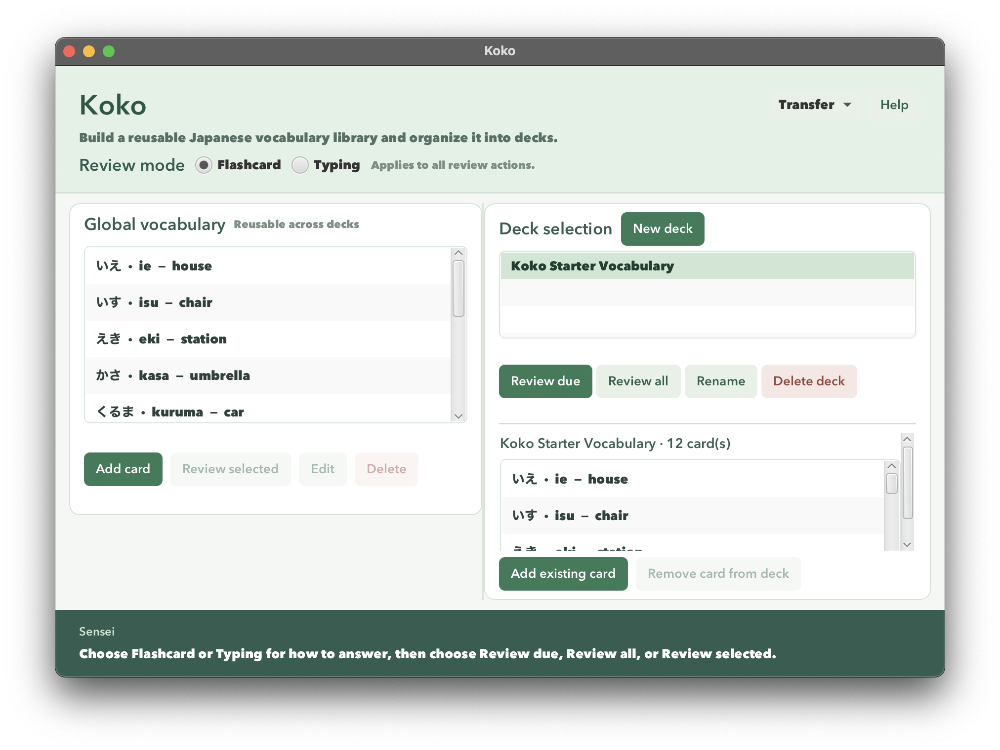

# Koko User Guide

Koko is a **desktop app for learning Japanese vocabulary**, built for beginners who want to keep their own word list and practice it with spaced repetition. It is driven by buttons and dialogs — there is no command language to learn — and it saves everything locally, so it works offline.

Every card has **Hiragana**, **Romaji** (the pronunciation in Latin letters), and an **English meaning**. Cards live in one global library and can be placed in any number of study decks, so a word learned in one deck keeps its progress in every other deck. Each card is practiced in two independent modes: **Flashcard** (recognize the Japanese) and **Typing** (produce the Hiragana).

## Table of contents

- [Quick start](#quick-start)
- [Koko at a glance](#koko-at-a-glance)
- [How cards and decks fit together](#how-cards-and-decks-fit-together)
- [Features](#features)
  - [Viewing help](#viewing-help)
  - [Valid card text and duplicates](#valid-card-text-and-duplicates)
  - [Adding a card](#adding-a-card)
  - [Editing a card](#editing-a-card)
  - [Deleting a card from the library](#deleting-a-card-from-the-library)
  - [Creating, selecting, and renaming decks](#creating-selecting-and-renaming-decks)
  - [Adding an existing card to a deck](#adding-an-existing-card-to-a-deck)
  - [Removing a card from a deck](#removing-a-card-from-a-deck)
  - [Deleting a deck](#deleting-a-deck)
  - [Choosing what to review](#choosing-what-to-review)
  - [Reviewing in Flashcard mode](#reviewing-in-flashcard-mode)
  - [Reviewing in Typing mode](#reviewing-in-typing-mode)
  - [Stop and read the summary](#stop-and-read-the-summary)
  - [Mastery and next review date](#mastery-and-next-review-date)
  - [Importing a deck](#importing-a-deck)
  - [Exporting a deck](#exporting-a-deck)
  - [Portable JSON example](#portable-json-example)
  - [Saving the data](#saving-the-data)
  - [Backing up or moving your library](#backing-up-or-moving-your-library)
- [FAQ](#faq)
- [Known issues](#known-issues)
- [Action summary](#action-summary)

---

## Quick start

1. **Install JDK 25.** Koko needs Java Development Kit 25 for the version of your operating system and processor. Check it in a terminal:

   ```shell
   java -version
   javac -version
   ```

   Both must report version 25. If you use SDKMAN on macOS and already have the project's JDK, select it in that terminal:

   ```shell
   sdk use java 25.0.3.fx-zulu
   ```

   Otherwise install JDK 25, point `JAVA_HOME` at it, add its `bin` folder to `PATH`, open a new terminal, and check the versions again.

2. **Get the app.** Clone the repository — the ready-to-run app is committed at [`release/koko.jar`](../release/koko.jar), with JavaFX included, so there is nothing to build:

   ```shell
   git clone https://github.com/shawnnygoh/CS3227-2610-MP1.git
   ```

   That JAR bundles JavaFX for Windows (x64), Apple Silicon macOS, and x64 Linux. On another machine — an Intel Mac or an ARM Linux box — either use a JavaFX-enabled JDK 25 (such as Zulu `jdk+fx`) or build your own JAR from the repository root with `./gradlew shadowJar` (`.\gradlew.bat shadowJar` on Windows PowerShell), which produces `build/libs/koko.jar` for your platform.

3. **Choose a home folder and launch.** Koko keeps its data in `data/koko-data.json` **inside the folder your terminal is in when you launch it** — not next to the JAR. Pick a folder you will keep using, `cd` into it, and run the JAR by its full path:

   ```shell
   java -jar "/full/path/to/CS3227-2610-MP1/release/koko.jar"
   ```

   Launching from the repository root instead (`java -jar release/koko.jar`) is fine too; that just makes the repository root your home folder. For a development launch, `./gradlew run` from the repository root works as well.

   > [!IMPORTANT]
   > Always launch Koko from the same folder. Starting it somewhere else gives you a new, empty library rather than your existing one. Run only one Koko at a time against a folder.

4. **Look around.** On a fresh start the **Koko** window opens with empty **Global vocabulary** and **Deck selection** lists. Nothing is loaded automatically. [Koko at a glance](#koko-at-a-glance) shows the screen with vocabulary in it and explains each area.

5. **Try the example deck.** With an empty library, and doing all the steps on the same day:

   1. Choose **Transfer > Import deck...** and open [`examples/koko-sample-deck.json`](../examples/koko-sample-deck.json) from the repository.
   2. Keep the suggested **Deck name** `Koko Starter Vocabulary` and click **Import**. Koko selects the new deck, shows `12 card(s)`, and adds 12 cards to the library, starting with `いえ · ie — house`, `いす · isu — chair`, and `えき · eki — station`.
   3. Under **Review mode** choose **Flashcard**, then click **Review due**. The first prompt is `いえ`. Click **Reveal** to check `ie` and `house`, then click **Correct**. Koko saves the outcome and shows `いす`.
   4. Click **Stop**. The summary reads **Attempted: 1**, **Correct: 1**, **Incorrect: 0**, **Remaining: 11**, **Status: stopped**. Click **Back to Home**.
   5. Select `いえ · ie — house` in **Global vocabulary**, choose **Typing**, and click **Review selected**. Type `いえ` for `house` and click **Submit**: the feedback shows **Correct** with your answer and the expected Hiragana. Click **Next**, then **Back to Home**.

6. Refer to [Features](#features) below for details of each action.

---

## Koko at a glance

The main management screen is called **Home** in this guide. Other screens return to it with **Back to Home**.



Above, the example deck has been imported: the library is on the left, decks and the selected deck's cards are on the right, and Sensei is along the bottom. **Review selected**, **Edit**, and **Delete** are greyed out because no card is selected yet.

| Area or control | What it does |
| --- | --- |
| **Global vocabulary** (left) | Every card you have, including cards in no deck. Select one for **Edit**, **Delete**, or **Review selected**. |
| **Deck selection** (right) | Your decks. Click a deck name to open its card list below. |
| Selected deck's card list | The deck's name, card count, and members. Select a card here for **Remove card from deck**. |
| **Review mode** | **Flashcard** or **Typing**. Applies to every review action. Flashcard is selected at startup. |
| **Transfer** | Opens **Import deck...** and **Export selected deck...**. |
| **Help** | Opens **Koko help**, which explains **How Koko works**. Scroll to read it, then click **Close**. |
| **Sensei** (bottom) | Guidance, confirmation of the last successful action, and the summary of the session you just left. |

Selections are one card or one deck at a time. A disabled button usually means something is not selected yet; each feature below lists what it needs. During a review, finish or **Stop** and then click **Back to Home** before managing cards, transferring decks, or changing mode.

To exit Koko, close the window.

## How cards and decks fit together

**The library owns every card; a deck only points at cards.** A card can be in no deck, one deck, or several decks — but only once in the same deck.

For example, add `ねこ · neko — cat` once and put it in both `Animals` and `Daily words`. Editing it changes the text in both decks. Reviewing it in Flashcard through either deck updates the same Flashcard progress everywhere, while its Typing progress is untouched.

| Action | Effect on the deck | Effect on the library and progress |
| --- | --- | --- |
| **Remove card from deck** | Removes the card from that deck only. | Card, both modes' progress, and other memberships are kept. |
| **Delete deck** | Deletes the deck and its card list, after confirmation. | Every card and its progress is kept, even cards now in no deck. |
| **Delete** (under **Global vocabulary**) | Removes the card from every deck that contains it. | Deletes the card and both modes' progress. |

> [!WARNING]
> There is no Undo, and no way to reset progress. Back up valuable data before deleting anything — see [Backing up or moving your library](#backing-up-or-moving-your-library). A recreated card starts over at mastery 0.

---

## Features

### Viewing help

Click **Help** on Home to open **Koko help**. It summarizes how Koko works; scroll through it and click **Close** to return. Help stays available even when a data problem has disabled everything else.

### Valid card text and duplicates

All three card fields are required. Koko strips surrounding whitespace and normalizes the text to Unicode NFC. Fields must be a single line: tabs, line breaks, and other control characters are rejected.

| Field | Accepted text | Example |
| --- | --- | --- |
| **Hiragana** | Hiragana, spaces, and the prolonged sound mark `ー`. Kanji, Katakana, Latin letters, and digits are rejected. | `ねこ` |
| **Romaji** | Latin letters (including accented ones), digits, spaces, and the punctuation below. | `neko` |
| **English meaning** | Same rules as Romaji. | `cat` |

Punctuation allowed in Romaji and English meaning: `- ' ’ . , ! ? : ; / & ( ) + =`. So `cat (animal)` is fine, while an emoji or a `"` is not. Koko checks characters only — it cannot tell whether your translation or pronunciation is right.

**Duplicates:** two cards are the same word when their Hiragana matches and their English meanings match ignoring case. Romaji is not compared. If `ねこ · neko — cat` exists, adding `ねこ · NEKO — CAT` is rejected; use [Adding an existing card to a deck](#adding-an-existing-card-to-a-deck) instead. A different English meaning makes a separate card — Koko does not merge synonyms or accept alternative answers.

### Adding a card

**Needs:** nothing selected.

1. Under **Global vocabulary**, click **Add card**.
2. Enter `ねこ` in **Hiragana**, `neko` in **Romaji**, and `cat` in **English meaning**.
3. Click **Add card** in the dialog.

The card appears at the end of the library list and Sensei confirms it. It starts at mastery 0, due today in both modes, and is **not** added to any deck even if a deck is selected.

> [!NOTE]
> If a field is blank, invalid, or duplicates an existing word, **Action not completed** explains why. Dismiss it and the form reopens with your entries intact. **Cancel** discards the card, and a failed save creates nothing.

### Editing a card

**Needs:** one card selected in **Global vocabulary** (selecting it in a deck's list is not enough).

1. Select `ねこ · neko — cat` and click **Edit**.
2. Change, for example, **English meaning** to `cat (animal)`.
3. Click **Save changes**.

The new text appears everywhere the card is used. **Both modes' progress and every deck membership are preserved** — editing never resets learning progress. The text and duplicate rules above still apply; invalid input reopens the form, and **Cancel** keeps the original text.

### Deleting a card from the library

**Needs:** one card selected in **Global vocabulary**.

1. Select the card and click **Delete**.
2. Check the card named in **Delete global vocabulary?**.
3. Click **OK** to delete it, or **Cancel** to keep it.

After **OK**, the card disappears from the library and from every deck, and its progress is gone. The decks themselves remain, possibly empty. Canceling changes nothing, and a failed save leaves the card in place.

### Creating, selecting, and renaming decks

- **Create:** click **New deck**, enter `Animals`, and click **OK**. The empty deck is added at the end of **Deck selection**. Creating a deck does not select it.
- **Select:** click the deck name. The heading below shows `Animals · 0 card(s)`, and its members appear underneath. Switching decks changes only that list, never the library list.
- **Rename:** select the deck, click **Rename**, enter the new name, and click **OK**. Position, cards, and progress are unchanged.

Deck names must be non-blank and unique ignoring case, so `Animals` and `animals` clash. Japanese names such as `どうぶつ` are fine — the card-field alphabet rules do not apply to deck names. A blank or clashing name reports **Action not completed** and reopens the dialog with your text; **Cancel** changes nothing.

### Adding an existing card to a deck

**Needs:** a deck selected, plus at least one card that is not already in it.

1. Select the deck.
2. Click **Add existing card**.
3. In **Add card to deck**, pick a card from **Vocabulary card:** and click **OK**.

The card is appended to the deck and the count goes up by one. No copy is made and no progress is reset. Add cards one at a time.

The chooser lists only cards that are not yet in this deck; whatever is selected in **Global vocabulary** does not affect it. If every card is already a member you get **No cards available**, and with no deck or no vocabulary the button is disabled. Canceling adds nothing.

### Removing a card from a deck

**Needs:** a deck selected, then a card selected in **that deck's** card list.

Click **Remove card from deck**. The membership disappears and the count drops — there is no confirmation. The card itself, its progress, and its other decks are untouched. To undo it, use **Add existing card** again; the card returns at the end of the list.

### Deleting a deck

**Needs:** a deck selected.

Click **Delete deck**, check the name in **Delete deck?**, and click **OK**. The deck and its card list are removed; the cards stay in your library and in any other decks. **Cancel** keeps the deck, and a failed save changes nothing.

### Choosing what to review

Pick **Flashcard** or **Typing** under **Review mode** first, then start a session:

| Action | Needs | Cards included, in order |
| --- | --- | --- |
| **Review due** | One deck. | Cards due today or earlier in that mode. Oldest due date first; ties follow deck order. |
| **Review all** | One deck. | Every member once, in deck order, including cards due later. |
| **Review selected** | One card in **Global vocabulary**. | Just that card, even if it is due later or in no deck. The selected deck is irrelevant. |

For example, **Typing** plus **Review all** on `Koko Starter Vocabulary` starts with `house`, then `chair`, then `station` — the file's order.

The session's card list is fixed when it starts. Each card appears once; a wrong or skipped card does not come back in that session. If the deck is empty or nothing is due, Koko shows **No cards in this review queue.** — click **Back to Home** and try another deck, mode, or **Review all**.

### Reviewing in Flashcard mode

**Needs:** a Flashcard session started with one of the actions above.

1. Read the **Hiragana** prompt and recall its pronunciation and meaning.
2. Click **Reveal** to show **Romaji** and **English meaning**. **Correct** and **Incorrect** stay disabled until you reveal.
3. Click **Correct** or **Incorrect**, honestly comparing what you recalled.
4. Koko saves the outcome and moves straight to the next prompt, or to the summary after the last card. There is no Next button in this mode, and no Skip.

Revealing by itself records nothing; only **Correct** or **Incorrect** changes your progress.

### Reviewing in Typing mode

**Needs:** a Typing session, plus a Hiragana input method — or text you can paste. Koko does **not** convert romaji into Hiragana for you.

1. Read the **English meaning** on the **English-to-Hiragana typing** screen.
2. Type the card's Hiragana into **Type Hiragana here** and click **Submit**. For `house`, type `いえ`.
3. Read **Your answer**, **Expected Hiragana**, and the verdict. The outcome is saved before this feedback appears.
4. Click **Next** for the following card, or to open the summary after the last one. While feedback shows, the answer field, **Submit**, and **Skip** are disabled.

**How answers are matched:** Koko strips surrounding whitespace, applies Unicode NFC normalization, and then requires an exact match with the stored Hiragana.

| Stored | You typed | Result |
| --- | --- | --- |
| `いえ` | `いえ` | Correct |
| `いえ` | ` いえ ` | Correct — surrounding spaces are ignored |
| `いえ` | `ie`, `イエ`, `家`, or `い え` | Incorrect — romaji, Katakana, Kanji, and inserted spaces do not match |
| `いえ` | (nothing) | Incorrect — a blank submission is an attempt, not a Skip |

A synonym or a plausible alternative translation is still incorrect: only this card's stored Hiragana counts.

**Skip:** click **Skip** while a prompt is showing to see the answer without grading yourself. It records a skipped attempt, keeps your Typing mastery, and schedules the card for tomorrow. The feedback shows **Skipped** with **Your answer** as `(blank)`, even if you had typed something. Click **Next** to continue. A skip counts as neither correct nor incorrect.

### Stop and read the summary

Click **Stop** during a prompt, after revealing a Flashcard answer, or during Typing feedback. The session ends immediately, with no confirmation. Unanswered cards keep the progress they already had; outcomes you already saved stay saved.

Then click **Back to Home** — that button is disabled while a session is still active. A stopped session cannot be resumed; start a new one from Home.

| Label | Meaning |
| --- | --- |
| **Attempted** | Outcomes saved in this session: Correct + Incorrect, plus Skipped in Typing. |
| **Correct** / **Incorrect** | Saved answers of each kind. |
| **Skipped** | Saved skips; shown in Typing only. |
| **Remaining** | Queued cards with no saved outcome. The current unanswered card counts; a card whose Typing feedback is on screen does not. |
| **Status** | `completed` after the whole queue, or `stopped` after **Stop**. |

For example, in a 12-card Typing session: answer one correctly, click **Next**, skip the second card, then **Stop** — **Attempted: 2**, **Correct: 1**, **Incorrect: 0**, **Skipped: 1**, **Remaining: 10**, **Status: stopped**.

The progress bar tracks saved attempts out of the starting queue, not mastery.

### Mastery and next review date

Every card starts at mastery **0**, due on the day you create or import it, separately for each mode. Progress is shared across decks but never between Flashcard and Typing.

| Saved outcome | Mastery in the active mode | Next due date |
| --- | --- | --- |
| Correct | +1, up to 5 | The interval below for the resulting mastery |
| Incorrect | −1, down to 0 | Tomorrow |
| Skip (Typing only) | Unchanged | Tomorrow |
| Stop, Reveal, or Next | No change | No change |

| Mastery after a correct answer | 1 | 2 | 3 | 4 | 5 |
| --- | --- | --- | --- | --- | --- |
| Days until due | 1 | 3 | 7 | 14 | 30 |

Intervals count from the day you actually answer, not from the old due date. A correct answer at mastery 1 gives mastery 2 and a due date three days from today. Practicing early still changes mastery and the due date; letting a card go overdue never lowers mastery by itself.

### Importing a deck

**Needs:** to be on Home, with a readable Koko portable `.json` file.

1. Choose **Transfer > Import deck...** and open the file.
2. Koko validates the whole document, then shows **Confirm the imported deck name** with the **Source file:** and the name stored inside the document.
3. Keep the suggested name or type another, then click **Import**.

A new deck is created and selected, with its cards in file order. Import never replaces an existing deck, so a blank or already-used name (ignoring case) keeps the dialog open with an error to correct. Renaming the import does not touch the source file.

For each word in the file, Koko applies the [duplicate rule](#valid-card-text-and-duplicates). A match **reuses your existing card and keeps its text and both modes' progress**, even if the file's romaji or capitalization differs. Only genuinely new words are added, at mastery 0 and due today. So re-importing the starter file under another name gives you a second deck, not duplicate cards and not a progress reset.

Canceling either the file chooser or the name dialog leaves everything unchanged. If saving fails, the dialog stays open with your name and a retry message.

> [!NOTE]
> Invalid JSON, wrong field types, an unsupported version, missing or extra fields, duplicate JSON keys, invalid card text, or the same word twice in one file rejects the entire import. Nothing is partially imported.

### Exporting a deck

**Needs:** a deck selected. Empty decks can be exported too.

1. Choose **Transfer > Export selected deck...**.
2. Pick a writable folder. Koko suggests a filename based on the deck name, which you can edit.
3. Confirm in your system's save dialog. If the destination already exists, only confirm replacement if you really mean to overwrite that file — the wording differs by operating system.
4. Check Sensei for the success message and the path.

Exported files contain **one deck's words in order and nothing else** — no card IDs, mastery, due dates, or session results. They are for sharing vocabulary, not for backing up your library.

For `Koko Starter Vocabulary` the suggested filename is `Koko Starter Vocabulary.json`. Saving it as `practice.json` changes the filename only; the deck name inside the file stays `Koko Starter Vocabulary`.

Suggested filenames replace characters that filenames cannot contain with underscores, trim trailing spaces and dots, and fall back to `koko-deck.json` if nothing usable is left; Japanese names and ordinary spaces are kept. A filename you type yourself only gets its suffix fixed: `practice` becomes `practice.json`, `practice.JSON` becomes `practice.json`, and `practice.txt` becomes `practice.txt.json`. If that final name turns out to be a *different* existing file, the save dialog opens again so you can confirm replacing the file that will really be replaced.

Canceling any dialog exports nothing. Koko also refuses to export over its own `data/koko-data.json`. If an export fails, Koko reports **Deck export was not completed** and nothing in your library changes — pick another destination and try again.

### Portable JSON example

To write your own small deck, save this as a UTF-8 text file named `animals.json` and import it. Use exactly these field names and types:

```json
{
  "schemaVersion": 1,
  "deckName": "Animals",
  "cards": [
    {
      "hiragana": "ねこ",
      "romaji": "neko",
      "englishMeaning": "cat"
    },
    {
      "hiragana": "いぬ",
      "romaji": "inu",
      "englishMeaning": "dog"
    }
  ]
}
```

`schemaVersion` must be the integer `1`, `deckName` a non-blank string, and `cards` an array of cards with exactly those three fields (an empty array is allowed). Do not add IDs or progress, use comments or trailing commas, or put several JSON documents in one file.

> [!IMPORTANT]
> `data/koko-data.json` is a different format and cannot be imported through **Transfer**, even though both files say version 1.

### Saving the data

Koko saves automatically after every successful change — adding or editing cards, deck changes, imports, and each review outcome. There is no Save button.

The file is `data/koko-data.json` **relative to the folder you launched Koko from**. If you launched from the repository root, it is `CS3227-2610-MP1/data/koko-data.json`; if you launched from a folder called `KokoPractice` using the JAR's full path, it is `KokoPractice/data/koko-data.json`. Moving the JAR does not move your library.

If a save fails — for example because the folder is read-only — Koko tells you, keeps your entries, and does **not** publish the change. Fix the problem and try the same action again.

### Backing up or moving your library

> [!CAUTION]
> Advanced users can edit `data/koko-data.json` directly, but Koko validates it strictly. If the file is invalid at startup, Koko reports the error, **leaves your file exactly as it is**, and disables managing, reviewing, and transferring until you fix or restore it. Always copy the file before editing it by hand.

1. Close every Koko window using that folder.
2. Copy `data/koko-data.json` somewhere else, labeled with the date and the app version you used.
3. To restore or move it, close Koko at the destination, back up whatever is there, then copy your file in as `data/koko-data.json`.
4. Launch the **same version** of Koko from that folder and check your cards and decks before changing anything.

A portable export holds one deck's words only, so exports are not a substitute for backing up this file.

---

## FAQ

**Q: I launched Koko and my cards are gone. What happened?**<br>
**A:** You almost certainly launched from a different folder. Koko reads `data/koko-data.json` from the terminal's current folder, not from the JAR's folder. Close Koko, `cd` back to your usual folder, and launch again.

**Q: How do I move my library to another computer?**<br>
**A:** Copy `data/koko-data.json` into the folder you will launch from on the other computer, then start the same version of Koko there. Do not use an exported deck for this: exports contain no progress.

**Q: What counts as a duplicate card?**<br>
**A:** Same Hiragana and same English meaning, ignoring letter case in the English. Romaji is not part of the comparison, so `ねこ · NEKO — CAT` is a duplicate of `ねこ · neko — cat`.

**Q: My typed answer looks correct but Koko marked it wrong. Why?**<br>
**A:** Only the exact stored Hiragana is accepted. Romaji (`ie`), Katakana (`イエ`), Kanji (`家`), spaces inside the word (`い え`), and near-synonyms all count as incorrect. Surrounding spaces are ignored.

**Q: Why is a button greyed out?**<br>
**A:** Either it needs a selection (a card in **Global vocabulary**, or a deck, or a card inside the deck's list), or a review is still running — click **Stop** and **Back to Home** first, or the library failed to load at startup, which disables everything but **Help**.

**Q: Can I use Kanji or Katakana on a card?**<br>
**A:** No. The **Hiragana** field accepts Hiragana, spaces, and `ー` only, while **Romaji** and **English meaning** accept Latin text. Koko stores beginner Hiragana vocabulary, so there is nowhere to put Kanji or Katakana.

**Q: Where do I see a card's mastery or due date?**<br>
**A:** Not in the app — Koko uses them to decide what is due, but does not display them. They are visible in `data/koko-data.json` if you open a copy of it.

**Q: Can I practice a card that is not due yet?**<br>
**A:** Yes. Use **Review all** for a whole deck, or **Review selected** for a single card. Those answers still update mastery and the next due date.

**Q: Can I undo a deletion or reset a card's progress?**<br>
**A:** No. Restore a backup, or delete and recreate the card, which starts it again at mastery 0.

---

## Known issues

1. **The data folder follows your terminal, not the JAR.** Launching Koko from a different folder silently gives you a new, empty library. Always launch from the same folder.
2. **One Koko at a time.** Two instances sharing a folder are not coordinated, and the last save wins. Close one before opening another.
3. **Reviews do not survive closing the app.** Sessions and summaries are never saved, so closing Koko mid-review loses the current unanswered card's session state — outcomes already saved are kept.
4. **Mastery and due dates are not shown in the UI.** You can only inspect them in the data file.
5. **No Undo and no progress reset.** Deletions are permanent unless you have a backup.
6. **No romaji conversion.** Typing mode needs a Hiragana input method or pasted text; Koko will not turn `neko` into `ねこ`.
7. **Koko replaces files atomically.** Both saving your library and replacing an existing export need a filesystem that supports atomic replacement. On the rare filesystem that does not, the action fails — leaving your existing file untouched — instead of falling back to a riskier write. Use a different folder or drive.
8. **The release JAR covers three platforms, not five.** JavaFX gives its x64 and ARM native libraries identical names, so one JAR can only carry one of each. `release/koko.jar` bundles Windows x64, Apple Silicon macOS, and x64 Linux. On an Intel Mac or ARM Linux, run it with a JavaFX-enabled JDK 25 or build `build/libs/koko.jar` locally with `./gradlew shadowJar`.

---

## Action summary

| Action | Where | Needs selected |
| --- | --- | --- |
| **Add card** | Home, under **Global vocabulary** | — |
| **Edit** / **Delete** | Home, under **Global vocabulary** | One card in **Global vocabulary** |
| **New deck** | Home, under **Deck selection** | — |
| **Rename** / **Delete deck** | Home, under **Deck selection** | One deck |
| **Add existing card** | Home, under the deck's card list | One deck (plus a card not already in it) |
| **Remove card from deck** | Home, under the deck's card list | One deck and one card in its list |
| **Review due** / **Review all** | Home, under **Deck selection** | One deck, plus a **Review mode** |
| **Review selected** | Home, under **Global vocabulary** | One card, plus a **Review mode** |
| **Reveal**, **Correct**, **Incorrect**, **Stop** | Flashcard review screen | — |
| **Submit**, **Skip**, **Next**, **Stop** | Typing review screen | — |
| **Back to Home** | Any review screen | Session finished or stopped |
| **Import deck...** / **Export selected deck...** | Home, **Transfer** menu | A deck, for export only |
| **Help** | Home, top right | — |
